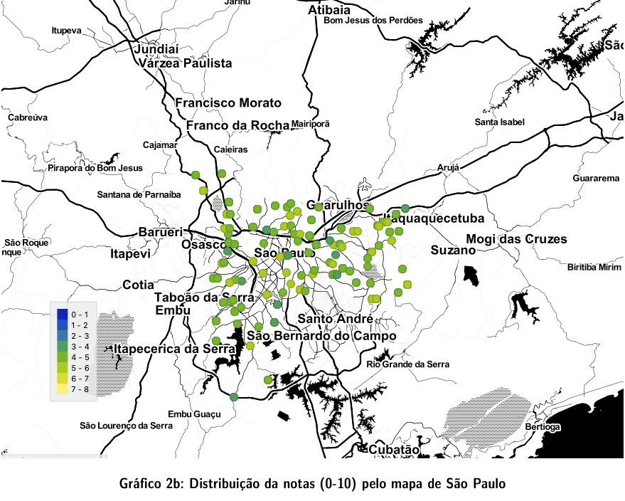

# Análise dos dados do IDEP de São Paulo (SP) 2019

## Projeto Mineração de Dados Educacionais (MDE) 
### Inteligência Artificial na Educação

# Autor

Ezequiel França dos Santos

# Resumo

O presente relatório tem o intuito de apresentar a análise dos dados do IDEP (Índice de Desenvolvimento da Educação Básica) da rede municipal de ensino de São Paulo. Além de algumas visualizações interessantes do contexto dos dados, ainda procuramos encontrar possíveis correlações que podem estar influenciando os resultados das escolas no IDEP, focando nos aspectos socioeconômicos das escolas e estudantes. Para isto foi utilizamos a base de dados fornecida no site da prefeitura de São Paulo, o programa [Orange](https://orangedatamining.com) com os addons Associate e Geo. 

#### [Arquivo Completo (PDF)](https://github.com/ezefranca/idep-2019/blob/main/IDEB_2019.pdf)

#### [Projeto Orange Data Mining (OWS)](https://github.com/ezefranca/idep-2019/blob/main/ideb-sp-2019.ows)

#### [Dados (já tratados com as coordenadas geográficas)](IDEP.csv)

 

#### Abril 2021

